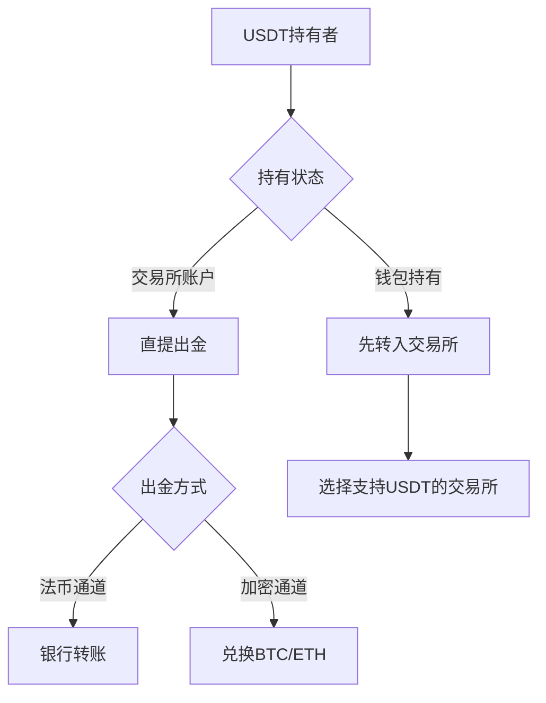

# USDT出金完全指南：海外与国内交易所操作教程

## USDT出金的核心价值解析
USDT作为全球流通量最大的稳定币，已成为加密货币市场的核心交易媒介。其美元1:1锚定的特性使其成为抵御市场波动的避风港，尤其适合新手投资者作为资金过渡工具。掌握USDT出金全流程，是实现加密资产与法币自由转换的关键技能。

👉 [立即注册全球领先交易所](https://bit.ly/okx_welcome)

## USDT出金基础知识图谱

### 稳定币特性深度解析
USDT（Tether）作为加密市场的重要基础设施，具有以下技术特征：

| 特性维度 | 核心优势 | 潜在风险 |
|---------|----------|----------|
| 价格稳定性 | 与美元1:1锚定 | 发行方储备透明度争议 |
| 跨链兼容性 | 支持TRC20、ERC20等多链 | 不同链间转账需手续费 |
| 流动性保障 | 全球TOP10交易所均支持 | 极端市场可能脱锚 |

### 出金路径选择矩阵


## 双轨制出金全流程实操

### 国内合规路径（适合保守型投资者）
1. **交易所选择标准**
   - 金融厅认证的合规平台（如bitFlyer、Coincheck）
   - 0.3%-0.5%的行业平均手续费
   - 支持7×24小时实时转账

2. **操作步骤**
   - 完成KYC认证（需准备：
     - 有效身份证件（驾照/护照）
     - 公共事业费账单
     - 本人银行账户信息
   - USDT→JPY即时兑换
   - 通过SMBC网络银行系统实时到账

3. **典型案例**
   ```python
   # 银行转账费用计算示例
   def calc_bank_fee(amount):
       if amount < 30000:
           return 330
       elif amount < 100000:
           return 550
       else:
           return 770
   print(f"100万円出金时手续费：{calc_bank_fee(1000000)}円")
   ```

### 海外高效路径（适合进取型投资者）
1. **头部交易所对比矩阵**
   | 平台 | 手续费 | 法币通道 | 特色功能 |
   |------|--------|----------|----------|
   | Bybit | 0.1% | PayPay/PayPal | P2P交易系统 |
   | Binance | 0.075% | 信用卡/银行 | Launchpad项目 |
   | OKX | 0.05% | Alipay/微信 | 跨境支付网关 |
   | MEXC | 0.02% | Crypto.com卡 | 量化交易接口 |

2. **最优路径选择策略**
   - **TRC20链优势**：单笔转账费用仅0.0005美元
   - **P2P溢价套利**：日本市场溢价率常达1.5-2%
   - **多签钱包配置**：冷热钱包分离管理

👉 [体验0.05%超低手续费通道](https://bit.ly/okx_welcome)

## 出金成本控制方案

### 手续费优化模型
```math
\text{综合成本率} = \frac{转账手续费 + 汇率损失 + 时间成本}{出金额度}
```
**优化建议：**
1. 单笔超过50万円采用银行电汇
2. 小额出金使用P2P即时交易
3. 非工作时间避免跨时区转账

### 税务合规指南
日本国税厅2024年新规要点：
- 年间利益20万円以下免税
- 跨境交易需申报「外国送金調書」
- 空投收益纳入综合课税

常见避税误区警示：
- 交易所自动申报制度
- 匿名交易不可追溯认知
- 海外钱包零申报可能性

## 风险防控体系构建

### 安全验证清单
- 双因素认证（Google Authenticator+短信）
- IP登录通知设置
- 大额转账邮箱确认
- API权限分级管理

### 典型诈骗防范
2023年日本金融厅警示案例：
1. 假冒交易所客服钓鱼
2. P2P交易中的"先放币"陷阱
3. 空投代币的恶意授权

应急处理流程：
```
发现异常 → 冻结账户 → 提交证据 → 联系虚拟货币协会 → 向警方备案
```

## 常见问题解答（FAQ）

Q：USDT出金需要多长时间？
A：银行转账通常1-3个工作日，P2P交易最快15分钟到账。TRC20链转账约3分钟完成。

Q：如何选择最优出金时间？
A：建议在东京时间10:00-15:00操作，此时日元汇率波动最小，且主要交易所流动性最佳。

Q：出金失败的常见原因？
A：
- 网络拥堵导致的链确认延迟
- 钱包地址格式错误（区分大小写）
- 反洗钱系统触发人工审核

👉 [全球用户首选安全平台](https://bit.ly/okx_welcome)

## 未来趋势与策略建议

2024年行业变革预判：
1. 日本银行数字货币（CBDC）试点对稳定币的影响
2. FATF旅行规则对匿名交易的限制
3. 交易所牌照审批趋严带来的合规成本

投资者应对策略：
- 配置多链钱包（至少包含TRC20+ERC20）
- 建立法币-稳定币-主流币三级资金池
- 学习智能合约基础避免授权风险

通过系统化的出金策略管理，投资者不仅能安全实现资产变现，更能构建完整的加密经济生态体系。建议定期关注日本金融厅监管动态，及时调整资金管理策略。