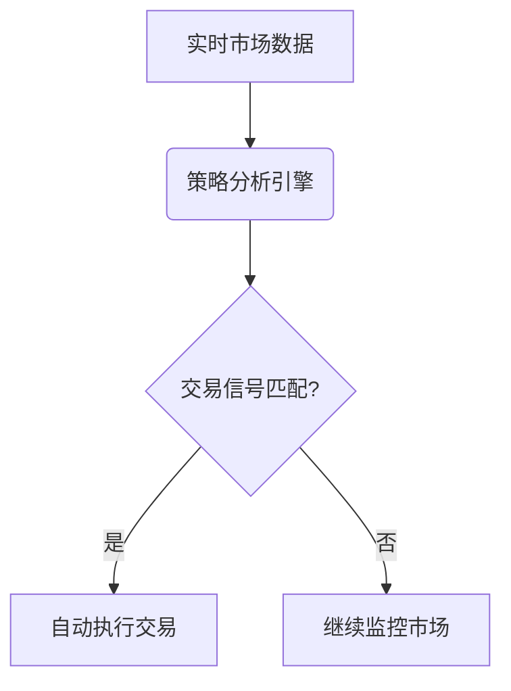

# 加密货币交易机器人是什么？

## 深入解析加密货币交易机器人

加密货币交易机器人是通过算法自动执行买卖操作的智能程序，它们通过API接口与加密货币交易所连接，代替人工完成交易指令。这类工具通过预设的交易策略和参数，帮助用户在波动剧烈的数字资产市场中捕捉最佳交易时机。其核心价值在于消除人为情绪干扰，提升交易效率，尤其适合7×24小时不间断运作的加密货币市场。

**核心优势**：
- 实现全天候自动化交易
- 消除情绪化决策风险
- 支持多策略组合应用
- 提升交易执行速度至毫秒级

> 关键洞察：全球78%的机构投资者已采用自动化交易工具，其中加密货币交易机器人使用率年增长达43%（数据来源：2023区块链技术白皮书）

## 运作原理详解

加密货币交易机器人的工作流程包含三个核心模块：
1. **数据采集系统**：实时获取市场深度、价格波动、成交量等数据
2. **策略分析引擎**：运用技术指标（MACD、RSI、布林带等）生成交易信号
3. **订单执行单元**：自动完成买卖操作，支持限价单、市价单等多种订单类型

**典型工作流程**：

## 五大主流交易策略

| 策略类型      | 运作原理                          | 适用场景                  |
|---------------|-----------------------------------|---------------------------|
| 套利交易      | 捕捉跨交易所价差                  | 交易所间流动性差异明显时  |
| 趋势跟随      | 通过技术指标识别价格趋势          | 单边行情持续期间          |
| 市场做市      | 挂单吃差价，提供市场流动性        | 波动率中等的市场环境      |
| 高频交易      | 利用微小价差快速买卖              | 极端波动或高流动性币种    |
| 资产再平衡    | 自动调整投资组合比例              | 多币种持仓的长期投资者    |

👉 [立即体验专业级交易工具](https://bit.ly/okx_welcome)

## 风险控制要点

使用加密货币交易机器人需要重点关注三大风险维度：
1. **算法风险**：市场突变可能导致策略失效，建议设置动态止损机制
2. **技术风险**：选择具备断网保护和自动重启功能的平台
3. **安全风险**：验证API权限设置，建议开启双重验证

**典型风险案例**：
- 2022年某DeFi代币单日暴跌92%，未设置止损的机器人损失超$500万
- 某交易所API接口漏洞导致300+机器人异常交易

## 选择指南：五大关键指标

选择交易机器人时应重点考察：
1. **策略兼容性**：支持自定义策略数量及复杂度
2. **执行速度**：API响应时间应低于50ms
3. **风控体系**：是否具备熔断机制和异常交易预警
4. **数据安全**：加密存储API密钥，支持IP白名单
5. **生态支持**：对接主流交易所数量及流动性

👉 [探索安全可靠的交易平台](https://bit.ly/okx_welcome)

### 常见问题解答

**Q：交易机器人适合新手使用吗？**  
A：建议从模拟盘开始，待熟悉策略配置和风险控制后再实盘操作。部分平台提供智能推荐策略，可降低入门门槛。

**Q：如何验证平台的安全性？**  
A：查看是否通过ISO 27001认证，是否有独立审计报告，用户资金是否采用冷钱包存储。

**Q：需要多大资金才能使用机器人交易？**  
A：主流平台起投门槛约$500，但建议准备至少$2000用于分散风险。部分平台提供分仓管理功能。

**Q：机器人交易会影响市场公平性吗？**  
A：合规平台均遵循交易所API使用规范，不会破坏市场秩序。高频交易需特别注意流动性影响。

**Q：如何评估机器人的盈利能力？**  
A：关注夏普比率（Sharpe Ratio）和最大回撤（Max Drawdown）指标，建议对比3个月以上的实测数据。

## 智能交易新时代
