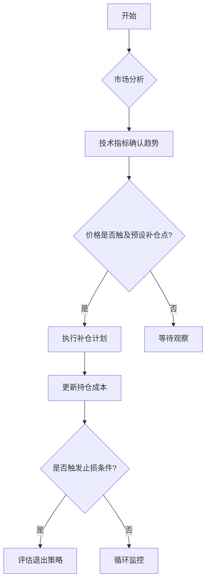

# 比特币补仓是什么意思？如何计算比特币补仓的成本？

## 什么是比特币补仓？

比特币补仓是指当投资者持有的比特币价格下跌时，通过追加购买比特币来降低整体持仓成本的操作策略。这种操作的核心逻辑在于通过在低位加仓，摊薄平均成本，从而提升未来价格上涨时的盈利空间。

### 补仓策略的核心价值
1. **成本摊薄效应**：通过在价格低点买入更多比特币，有效降低持仓均价
2. **风险对冲机制**：分散单一买入时点的价格波动风险
3. **收益增强潜力**：当市场价格回升至平均成本线时即可开始盈利

👉 [了解更多比特币投资策略](https://bit.ly/okx_welcome)

### 经典案例解析
假设投资者A在比特币价格为50,000美元时买入1枚BTC，当价格跌至40,000美元时选择补仓0.5枚：
- 初始持仓成本：50,000美元
- 补仓成本：40,000 × 0.5 = 20,000美元
- 新平均成本：(50,000 + 20,000) ÷ 1.5 = 46,666.67美元

通过补仓操作，持仓成本从50,000美元降至46,666.67美元，降幅达6.7%。

## 比特币补仓成本计算方法

### 标准计算公式
$$
\text{平均成本} = \frac{\text{各次买入金额总和}}{\text{累计持仓数量}}
$$

### 三步计算法示例

| 操作阶段 | 购买价格(USD) | 购买数量(BTC) | 投资金额(USD) | 累计持仓(BTC) | 累计成本(USD) | 当前均价(USD) |
|---------|---------------|---------------|---------------|---------------|---------------|---------------|
| 初始买入 | 50,000        | 1.0           | 50,000        | 1.0           | 50,000        | 50,000        |
| 首次补仓 | 40,000        | 0.5           | 20,000        | 1.5           | 70,000        | 46,666.67     |
| 二次补仓 | 30,000        | 0.333         | 10,000        | 1.833         | 80,000        | 43,636.36     |

通过三次买入操作，平均持仓成本从50,000美元降至43,636美元，降幅达12.7%。

### 动态成本模拟模型
投资者可建立Excel模型实时跟踪：
1. 设置价格观测区间（如5,000美元步长）
2. 预设不同价格点的补仓数量
3. 自动计算动态平均成本曲线

## 补仓策略实施要点

### 时机选择关键指标
- **技术分析**：RSI指标低于30时进入超卖区域，MACD线突破信号线形成金叉
- **基本面判断**：关注美联储货币政策、机构投资动向、全球支付应用场景扩展
- **资金管理**：建议单次补仓不超过总资金的10%，预留3-5次补仓空间

### 风险控制矩阵

| 风险类型       | 防范措施                     | 应对策略                     |
|----------------|------------------------------|------------------------------|
| 市场持续下跌   | 设置补仓间隔价格区间          | 建立阶梯式补仓计划           |
| 流动性风险     | 保持20%以上现金储备           | 选择主流交易平台进行操作     |
| 情绪化交易     | 制定量化交易规则              | 使用自动交易工具执行策略     |

👉 [获取专业交易工具支持](https://bit.ly/okx_welcome)

### 常见问题解答（FAQ）

**Q：比特币价格持续下跌时该如何补仓？**  
A：建议采用「等差数列补仓法」，每下跌固定金额（如5,000美元）补仓一次，同时逐步增加补仓量（如每次增加0.1 BTC）。

**Q：如何确定补仓的最佳价格点？**  
A：结合历史波动率计算支撑位，通常选择前低支撑位+1.618黄金分割位作为补仓区间，同时参考200日均线位置。

**Q：补仓操作是否会影响投资组合平衡？**  
A：需要建立动态再平衡机制，当BTC持仓占比超过初始配置的20%时，暂停补仓并评估其他资产配置机会。

## 高级补仓技巧

### 网格交易策略
设置价格区间和网格密度：
- 基础网格：40,000-50,000美元区间
- 网格数量：5层（每2,000美元为一档）
- 单位网格资金：2,000美元

### 期权对冲策略
在补仓同时买入平价看涨期权：
- 权利金成本约3-5%
- 保护下跌风险的同时保留上行收益

### 价值平均策略（DCA+）
每月固定投入+动态调整：
1. 设定目标增长率（如每月5%）
2. 当市值低于目标值时自动补仓
3. 超过目标值时部分止盈

👉 [探索智能交易解决方案](https://bit.ly/okx_welcome)

## 补仓决策流程图

通过系统化决策流程，可有效避免情绪化操作，确保补仓策略的纪律性执行。

### 市场周期应对策略

| 市场阶段     | 补仓频率 | 单次补仓量 | 风险敞口控制 |
|--------------|----------|------------|--------------|
| 牛市初期     | 高频次   | 低数量     | 保持70%以上仓位 |
| 牛市末期     | 低频次   | 高数量     | 设置动态止盈 |
| 熊市震荡期   | 固定间隔 | 等量补仓   | 单次≤5%资金 |
| 底部筑底阶段 | 金字塔式 | 逐步增量   | 预留30%资金 |

投资者应根据市场周期调整补仓策略，避免在趋势未明阶段过度操作。
