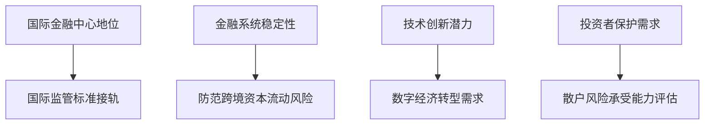

# 香港比特币政策解析：合规边界与投资指南

## 引言：国际金融中心的数字资产立场

作为全球第三大金融中心，香港对加密货币的监管态度始终牵动着全球投资者的神经。随着区块链技术的快速迭代与数字资产市场的膨胀，香港特区政府在创新与风险防控之间持续寻找平衡点。本文将深入剖析当前香港对比特币的监管框架，揭示政策演变背后的逻辑，并为投资者提供实用指南。

👉 [了解最新加密货币交易政策](https://bit.ly/okx_welcome)

## 当前监管现状：框架明确但边界清晰

### 核心政策解读
根据香港证监会（SFC）最新指引，比特币等虚拟资产的监管呈现以下特征：

| 监管维度        | 具体要求                          |
|-----------------|-----------------------------------|
| 交易场所        | 需持牌经营，仅允许专业投资者参与 |
| 发行活动        | ICO须符合《证券及期货条例》        |
| 反洗钱义务      | 金融机构需执行客户尽职调查        |
| 税务处理        | 持有比特币暂不征收资本利得税      |

值得注意的是，个人持有比特币并不违法，但通过无牌平台交易将面临最高7年监禁及100万港元罚款。2023年虚拟资产交易平台发牌制度实施后，目前仅有两家机构获得正式牌照。

### 监管机构职能划分
- **证监会**：负责持牌交易平台监管
- **金融管理局**：监测系统性金融风险
- **海关**：打击非法跨境资金流动
- **税务局**：探索数字资产税务框架

👉 [获取合规交易平台信息](https://bit.ly/okx_welcome)

## 政策演变历程：从审慎观察到框架构建

### 关键时间节点回溯
- **2017年**：央行叫停ICO后，香港成为内地资金外溢的"避风港"
- **2019年**：实施《打击洗钱及恐怖分子资金筹集条例》修订
- **2021年**：推出"监管沙盒"测试DeFi产品
- **2023年**：正式实施虚拟资产服务提供商（VASP）牌照制度

### 监管逻辑的三次跃迁
1. **风险隔离期（2017-2019）**：限制散户参与，防范金融风险
2. **制度建设期（2020-2022）**：引入"相同业务、相同风险、相同监管"原则
3. **生态培育期（2023至今）**：试点稳定币监管，探索Web3.0应用场景

## 监管决策背后的多重考量

### 四维决策模型

### 典型监管案例解析
以2022年某国际交易所被拒发牌照事件为例，监管机构重点审查了以下环节：
- 客户资产隔离机制
- 交易记录保存系统
- 市场操纵监测算法
- 应急风险准备金比例

👉 [探索数字资产投资新机遇](https://bit.ly/okx_welcome)

## 未来趋势与投资建议

### 监管演进预测（2024-2026）
| 阶段         | 监管重点                     | 市场影响               |
|--------------|------------------------------|------------------------|
| 2024-Q2      | 稳定币发行储备审计制度落地   | 币值波动性可能降低     |
| 2025-Q1      | 推出机构级数字资产托管牌照   | 大宗交易量有望提升     |
| 2026-Q3      | 实施DeFi平台责任穿透监管     | 协议代码审计成合规重点 |

### 投资者行动指南
1. **持牌平台验证**：通过证监会官网查询VAPS牌照编号
2. **交易记录留存**：保存完整KYC/AML文件至少7年
3. **税务筹划策略**：区分"投资持有"与"商业交易"税务属性
4. **风险配置比例**：建议不超过总资产的5%配置数字资产

## 常见问题解答

**Q：个人持有比特币是否需要申报？**
A：目前无需主动申报，但通过银行账户进行的交易可能触发反洗钱监测。

**Q：如何辨别持牌交易平台？**
A：证监会官网提供实时更新的持牌机构名录，包含机构编号及业务范围。

**Q：使用境外平台交易有何风险？**
A：可能面临资金冻结、纠纷无法维权等风险，且不符合反洗钱合规要求。

**Q：数字资产收益如何纳税？**
A：暂不征收资本利得税，但矿业收入、质押收益需按经营所得申报。

**Q：未来是否会开放ETF等衍生品？**
A：证监会已启动虚拟资产ETF研究，预计2025年后进入试点阶段。

## 结语：在创新与风控间寻找平衡
