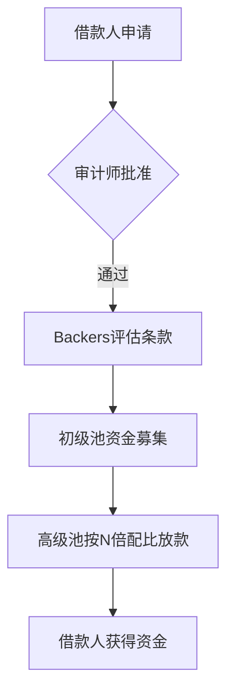

# Goldfinch Finance：现实资产与DeFi借贷的创新融合

## 背景与核心价值
在去中心化金融（DeFi）领域，传统借贷模式面临两大挑战：过度依赖超额抵押导致资金效率低下，以及信用账户机制限制资金使用场景。Goldfinch Finance通过引入现实世界资产（RWA）解决方案，成功搭建起链下信贷需求与链上流动性之间的桥梁。

该协议通过与亚非拉地区金融机构合作，将发展中国家的信贷需求转化为链上投资机会。投资者仅需存入USDC即可获得稳定收益，同时享受GFI代币奖励。这种创新模式不仅提升了资金利用率，更为全球资本配置提供了新路径。

👉 [深入了解Goldfinch产品机制](https://bit.ly/okx_welcome)

## 团队与资本布局
Goldfinch由Coinbase前高管团队创立，核心成员涵盖金融工程、区块链开发及合规管理等多领域专家。项目获得包括a16z、Polychain Capital等顶级风投支持，三轮融资累计获得超3000万美元资金注入。

关键团队信息：
| 类别 | 团队规模 | 核心成员背景 |
|-------|---------|--------------|
| 开发团队 | 52人 | Coinbase技术骨干 |
| 审计团队 | 22人（Warbler Labs） | 前金融监管机构顾问 |
| 合规团队 | 8人 | 国际律所金融合规专家 |

## 协议运作机制解析
Goldfinch协议构建了独特的三级风险分层体系：

### 三重角色体系
1. **投资者（Investor）**
   - **Backers**：承担第一损失风险，自主评估借款池
   - **流动性提供者（LP）**：获取固定收益，承担次级风险

2. **借款人（Borrower）**
   - 主要来自金融基础设施薄弱地区
   - 需通过核心贡献者人工审计

3. **审计师（Auditor）**
   - 通过GFI质押参与风控
   - 现阶段由核心团队担任

### 资金池运作流程

## 投资产品分析
当前平台开放产品数据：
| 指标 | 数据 |
|-------|------|
| 年化收益率 | 7.8%（高级池） |
| 累计贷款笔数 | 24笔 |
| 未到期贷款总额 | $101M |
| 已偿还贷款 | 11笔 |
| 违约率 | 0% |

重点借款人案例：
- **Tugende**：东非小微金融解决方案商，服务20万+非正规经济从业者
- **Greenway**：印度清洁能源企业，受益于Almavest资本支持
- **Addem Capital**：拉美中小企业贷款平台，已服务超5000家初创企业

## 代币经济模型
GFI代币作为协议治理核心，总量上限114,285,714枚。其分配结构呈现显著激励倾斜：

创新机制：
- **Membership功能**：GFI与FIDU双质押提升收益
- **流动性挖矿**：FIDU-USDC LP质押获取GFI奖励

## 竞品对比分析
| 指标 | Goldfinch | Centrifuge | Credix |
|-------|-----------|------------|--------|
| TVL（亿美元） | 1.02 | 0.89 | 0.76 |
| 平均APY | 8.2% | 6.5% | 9.1% |
| 违约率 | 0% | 1.2% | 0.5% |
| 资本支持 | a16z、Coinbase等 | Chainlink、Arrington | Solana生态基金 |

## 市场前景与挑战
根据IMF数据，全球私人债务市场规模达GDP的159.1%，约为128万亿美元。Goldfinch通过RWA模式切入这一蓝海市场，已实现三个关键突破：
1. **监管合规**：获得美国SECRegA+认证
2. **资产多元化**：新增美国金融科技产品线
3. **技术迭代**：推出Stratos风险评估系统

面临挑战：
- **地缘政治风险**：新兴市场汇率波动
- **技术安全**：智能合约审计覆盖率需提升
- **竞争压力**：Centrifuge等竞品加速布局

## 风险管理FAQ
### Q1：Goldfinch如何降低违约风险？
A：采用三重风控体系：
1. 核心审计团队人工尽调
2. GFI质押激励借款人履约
3. 优先/次级资金池风险分层

### Q2：GFI代币有哪些实用场景？
A：涵盖四大核心功能：
- 治理投票权
- 审计师质押抵押
- 流动性挖矿奖励
- 收益率提升工具

### Q3：投资门槛是否过高？
A：当前要求：
- 最小投资金额：1000 USDC
- KYC认证必要
- 需持有ETH网络Gas费

未来将开放小额投资产品，降低准入门槛。

👉 [查看GFI代币实时行情](https://bit.ly/okx_welcome)

## 投资价值评估
Goldfinch构建了独特的价值闭环：
1. **资产端**：连接新兴市场高收益贷款
2. **资金端**：稳定币收益+代币激励
3. **生态端**：获得Coinbase等头部机构背书

长期看点：
- RWA市场规模年复合增长率达35%
- 美联储政策调整带来的套利机会
- EIP-484等以太坊升级提升协议效率

## 发展路线展望
2024-2025关键节点：
- Q2：开放审计师社区化治理
- Q3：推出亚洲中小企业债券产品
- 2025：实现与传统征信系统数据互通

随着美国SEC对RWA监管框架的逐步明晰，Goldfinch有望成为合规化DeFi借贷的标杆项目。当前估值较同类项目折价约40%，具备显著投资安全边际。

👉 [立即参与Goldfinch生态建设](https://bit.ly/okx_welcome)