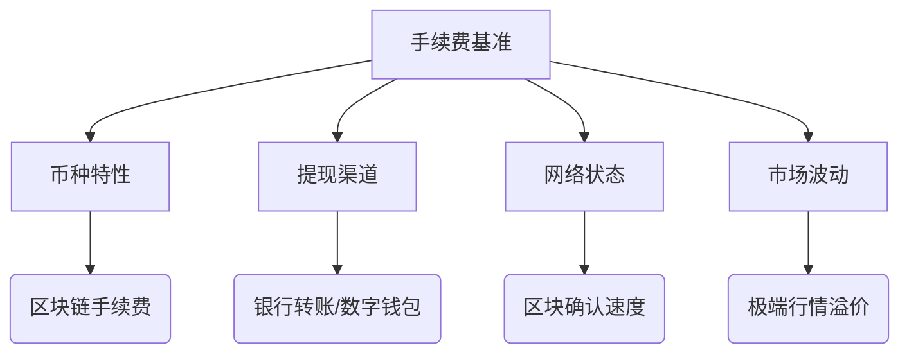

# OKX交易所提现手续费详解及优化指南

## 一、核心概念解析
OKX交易所提现手续费是指用户将数字资产从平台转出至外部钱包或银行账户时产生的费用。作为全球领先的数字资产交易平台，OKX针对不同币种和提现渠道制定了差异化收费策略。该费用主要用于覆盖区块链网络成本、支付渠道维护及安全风控支出，直接影响用户资金流转效率。

👉 [查看实时手续费标准](https://bit.ly/okx_welcome)

## 二、手续费计算机制深度解析

### 1. 多维度定价模型
| 计费方式       | 适用场景                  | 特点说明                     |
|----------------|---------------------------|------------------------------|
| 固定费率       | 比特币、以太坊等主流币种  | 单笔费用恒定，适合高频小额交易 |
| 比例收费       | 新兴及小众代币            | 费用随提现金额浮动            |
| 动态调整机制   | 网络拥堵或波动期          | 实时响应链上拥堵状况          |

### 2. 影响因子关联矩阵

## 三、成本优化实战策略

### 1. 币种选择优化
- **低Gas费代币**：选择采用Layer2解决方案的代币（如OKB、USDT-TRC20）
- **网络时段管理**：在区块链低峰期（北京时间凌晨3-6点）执行大额转账
- **渠道组合策略**：法币通道适合5万美元以上大额提现，数字钱包适合小额高频操作

👉 [获取最新优惠活动信息](https://bit.ly/okx_welcome)

### 2. 费用对比示例
| 提现方式       | 比特币(BTC)   | 以太坊(ETH)   | USDT(TRC20)   |
|----------------|--------------|--------------|--------------|
| 链上转账       | 0.0005 BTC    | 0.005 ETH     | 1 USDT        |
| 法币通道       | 1.5%手续费   | 1.8%手续费    | 0.8%手续费    |
| 跨平台划转     | 免手续费     | 免手续费      | 免手续费      |

## 四、进阶操作指南

### 1. 手续费查看三步法
1. 登录OKX账户进入[资金管理]
2. 选择目标币种点击"提现"
3. 系统会实时显示当前网络建议费率

### 2. 异常处理流程
当遇到手续费异常波动时：
1. 确认区块链浏览器当前拥堵指数
2. 检查账户等级对应的费率特权
3. 联系VIP专属客服申请人工审核

👉 [联系专业客服团队](https://bit.ly/okx_welcome)

## 五、FAQ高频问题解答

**Q：为什么不同时间提现费用有差异？**  
A：OKX采用动态费率机制，会根据区块链实时拥堵状况（如比特币网络算力波动、以太坊GasPrice变化）自动调整推荐费率，确保交易快速确认。

**Q：如何享受手续费折扣？**  
A：可通过以下方式获取优惠：
- 提升账户VIP等级（持仓OKB可享最高20%返佣）
- 参与平台定期推出的费率减免活动
- 使用OKX Earn质押服务获取手续费抵扣权益

**Q：提现失败是否收取费用？**  
A：链上转账失败仍会产生矿工费，但平台通道（如法币提现）不成功不收费。建议大额转账前先进行小额测试。

**Q：能否自定义手续费率？**  
A：支持高级用户手动调整Gas参数，但需注意：
- 过低费率可能导致交易卡顿
- 建议参考系统推荐值±20%区间浮动
- 新手建议使用"智能推荐"模式

## 六、风险控制建议

1. **双重验证机制**：启用Google Authenticator+短信验证
2. **限额管理**：根据账户安全等级设置单日转账上限
3. **地址白名单**：对常用收款地址进行标记认证
4. **异常监控**：开启邮件/SMS实时通知功能

## 七、未来趋势洞察

2024年手续费结构将呈现三大变革：
1. **智能分层**：基于用户交易频次的动态费率模型
2. **生态减免**：DeFi质押用户享专属手续费补贴