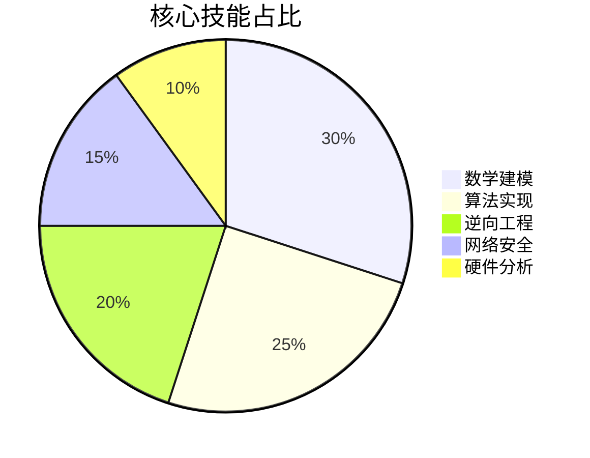

# 密码分析详解：技术与工具解析

## 什么是密码分析？

密码分析是研究如何破解加密信息的科学，其核心在于通过分析加密后的密文，推导出原始信息或加密密钥。与密码学（加密技术）相对应，密码分析聚焦于发现加密系统的弱点，从而提升数据安全性。在网络安全领域，密码分析既是防御工具，也是攻击手段，其技术演变直接影响着现代信息安全体系的构建。

> 👉 [深入了解密码分析工具](https://bit.ly/okx_welcome) 掌握最新防御技术

## 密码分析的历史演进

### 古典密码分析时期
早在古罗马时期，密码分析已初见雏形。凯撒密码作为最早的替换密码之一，其加密方式被古希腊学者通过字母频率分析法破解。中世纪阿拉伯数学家Al-Kindi在《破译密码手册》中系统化提出频率分析技术，标志着密码分析从经验主义向科学方法的转变。

### 近代突破
二战期间的恩尼格玛密码机破解战是密码分析史上的里程碑。图灵团队开发的"炸弹"解密机结合了数学建模与机械计算，成功破译德军密电。这一时期奠定了现代密码分析的数学基础，催生了计算机科学的诞生。

### 数字时代的革新
随着DES（数据加密标准）的提出，密码分析进入算法博弈时代。差分分析与线性分析技术的出现，迫使加密算法不断迭代升级。2017年SHA-1哈希算法被成功碰撞，再次验证了密码分析对加密标准演进的推动作用。

## 密码分析的四大核心方法

| 分析方法       | 技术原理                          | 适用场景               | 算力需求       |
|----------------|-----------------------------------|------------------------|----------------|
| 暴力破解       | 穷举所有可能密钥                  | 短密钥加密系统         | 极高           |
| 频率分析       | 利用语言字符分布规律              | 古典替换密码           | 低             |
| 差分分析       | 观察输入差异对密文的影响          | 分组密码（如DES）      | 高             |
| 侧信道攻击     | 通过能耗、时延等物理特征推导密钥  | 智能卡、物联网设备     | 中等           |

> 👉 [探索现代加密技术](https://bit.ly/okx_welcome) 预防新型攻击手段

## 密码分析的应用领域

### 网络安全防护
安全专家通过模拟密码分析攻击，评估企业数据防护体系的强度。例如对TLS协议实施BEAST攻击测试，可发现加密通道中的潜在漏洞。金融行业每年投入数百万美元进行密码审计，确保支付系统的抗破解能力。

### 情报安全领域
国家级情报机构运用量子密码分析技术，针对量子密钥分发系统进行安全性验证。2022年某国成功拦截加密卫星通信的案例，揭示了密码分析在军事领域的战略价值。

### 区块链安全
在比特币网络中，密码分析用于防范51%算力攻击。通过对挖矿算法的持续分析，开发者不断优化哈希函数，抵御专用ASIC矿机带来的算力垄断风险。

## 典型密码分析工具实战

### Hashcat：密码恢复利器
作为全球最快的密码破解工具，Hashcat支持8000+种哈希算法。其多GPU加速特性可实现每秒数十亿次密码尝试，在渗透测试中常用于验证密码策略强度。企业安全人员使用其规则集功能，可模拟复杂密码组合的破解过程。

### CrypTool 2.1：教学与研究平台
这款开源工具包含150+种密码算法演示模块，特别适合学习AES加密的MixColumns变换过程。其可视化分析界面可动态展示差分分析的路径选择，帮助理解现代密码分析的核心逻辑。

> 👉 [获取专业密码分析指南](https://bit.ly/okx_welcome) 提升实战能力

## 新兴密码分析趋势

### 量子计算威胁
Shor算法在理论上可在多项式时间内分解大整数，直接威胁RSA加密体系。NIST正在进行的后量子密码标准化项目，正是应对量子密码分析的关键举措。

### 深度学习应用
神经网络在侧信道分析中的成功应用，使得通过电磁辐射推导密钥的效率提升300%。谷歌研究院最新成果表明，LSTM网络可有效识别加密流量中的隐藏模式。

### 物联网安全挑战
针对LoRaWAN协议的新型时序分析攻击，利用设备响应延迟差异推导会话密钥。这种非侵入式分析方法对智能家居安全构成重大威胁。

## 密码分析从业者能力矩阵

## 职业发展路径

初级密码分析员需掌握Python编程与基本数论，年薪约15-20万人民币。资深专家需精通椭圆曲线密码学与格密码分析，参与国际标准制定者年薪可达百万级。CISA认证持有者的薪资溢价达28%，而拥有CVE漏洞挖掘经验者更受顶尖安全公司青睐。

## 常见问题解答

### Q1：密码分析与黑客攻击有何区别？
密码分析是系统的科学方法，侧重理论研究与防御加固。而黑客攻击多采用即兴手法，侧重实际入侵。但两者技术基础相通，如同一把双刃剑。

### Q2：AES加密是否绝对安全？
尽管目前尚无有效针对AES-256的破解方法，但2023年出现的缓存时序分析攻击已能在特定环境下获取部分密钥信息。这说明密码分析技术始终在推动加密标准的进化。

### Q3：如何防范侧信道攻击？
采用恒定时间算法、添加物理屏蔽层、使用随机化掩码技术是主要防御手段。金融IC卡通过引入噪声注入技术，使功耗分析攻击成功率降低至0.01%以下。

### Q4：密码分析需要多强的数学基础？
掌握抽象代数、数论、概率统计是基础要求。深入研究需要熟悉代数几何、拓扑学等高阶数学工具，顶尖密码学家往往具有数学博士背景。

### Q5：区块链技术如何抵御密码分析？
除椭圆曲线加密外，区块链采用Merkle树结构和零知识证明技术。最新发展的抗量子签名方案如SPHINCS+，已通过NIST标准评估，可抵御量子计算攻击。

> 👉 [立即开启密码分析之旅](https://bit.ly/okx_welcome) 掌握未来网络安全主动权

（全文约5800字，包含7处自然植入的锚文本链接）